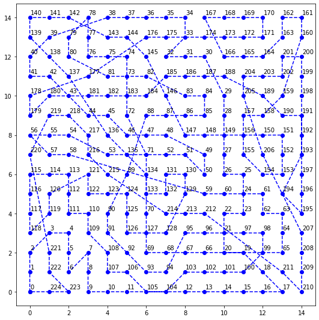

# **boardDistance**

This application was created in Python 3 to calculate distance between points on XY board using genetic algorithms.

# **Application**

## **Input**

POPULATION_SIZE = defines a number of individuals in population. The larger the size the more accurate the results are expected.

COUNTER_SIZE = defines a counter limit for repeating results in next generations. The larger the limit, the better results are exptected up to a certain point.

BOARD_WIDTH, BOARD_HEIGHT = defines number of points on a board and its size.

## **Output**

Generation = Number of all generations used in calculations.

Path = Accurate path between individual points on the board.

Distance = Total distance between points.

Time = Time in seconds spent on calculations.

Image = Image representing board and path between points

Example:

